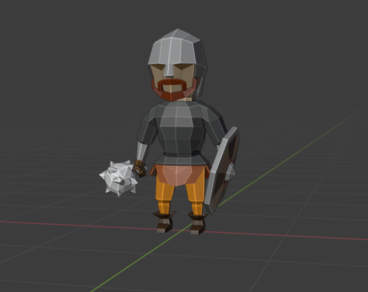
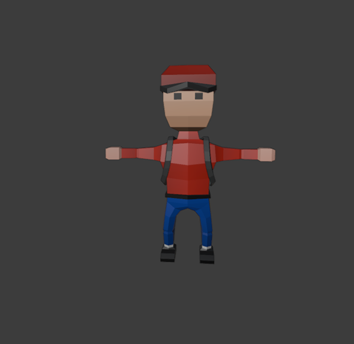
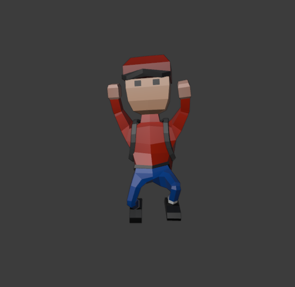
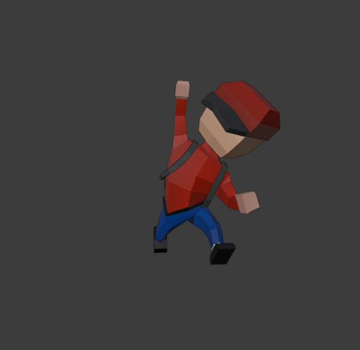
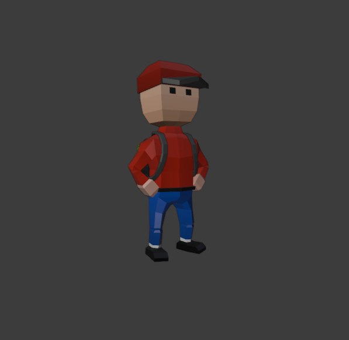
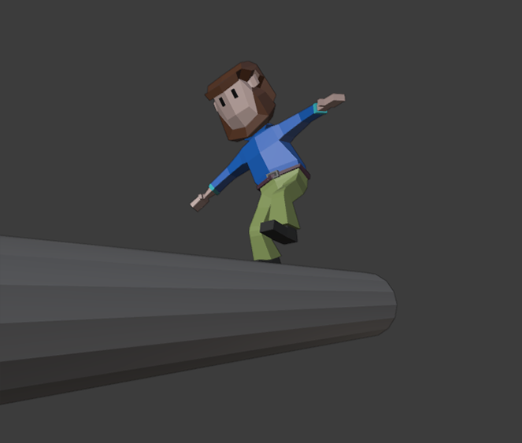
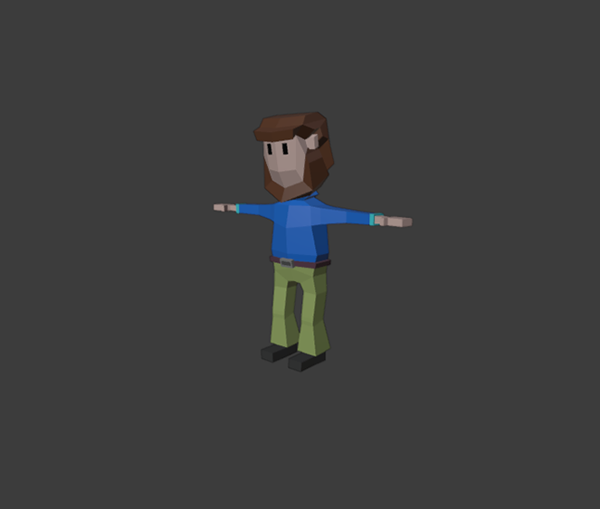

# low-poly-character
 Here some low poly game character made using blender. (2020)

 Some low poly game character I made for my game in 2020. It inclueds Warrior and his weapon, Hero and a Beard-Man.

## Screen shot

### Warrior
    
   

### Hero
   
      

### Beard-Man
   
      

## 3D file

### warrior

* **[Warrior](https://github.com/XAbirHasan/3D-Basic/blob/master/3d-file/sunglass.fbx)**
* **[axe](https://github.com/XAbirHasan/3D-Basic/blob/master/3d-file/headphone.fbx)**
* **[crusher](https://github.com/XAbirHasan/3D-Basic/blob/master/3d-file/egg.fbx)**
* **[shield](https://github.com/XAbirHasan/3D-Basic/blob/master/3d-file/pigibank.fbx)**
* **[sord](https://github.com/XAbirHasan/3D-Basic/blob/master/3d-file/hat.fbx)**
* **[spear](https://github.com/XAbirHasan/3D-Basic/blob/master/3d-file/dumbel.fbx)**

### Brox
* **[Hero](https://github.com/XAbirHasan/3D-Basic/blob/master/3d-file/pencil.fbx)**
* **[Hat](https://github.com/XAbirHasan/3D-Basic/blob/master/3d-file/shoes.fbx)**
* **[bagpack](https://github.com/XAbirHasan/3D-Basic/blob/master/3d-file/apples.fbx)**

### 
* **[Beard-Man](https://github.com/XAbirHasan/3D-Basic/blob/master/3d-file/apples.fbx)**

## Authors

* **AbirHasan**

Check out my other works [@XAbirHasan](https://github.com/XAbirHasan)

